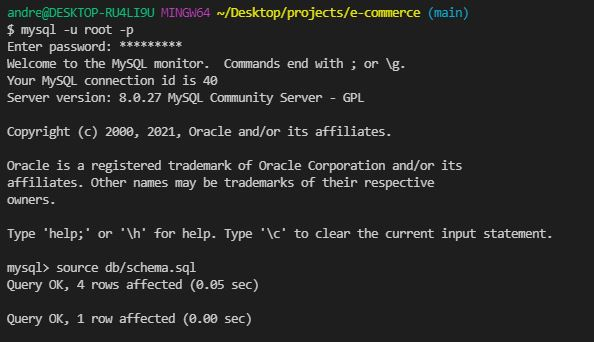
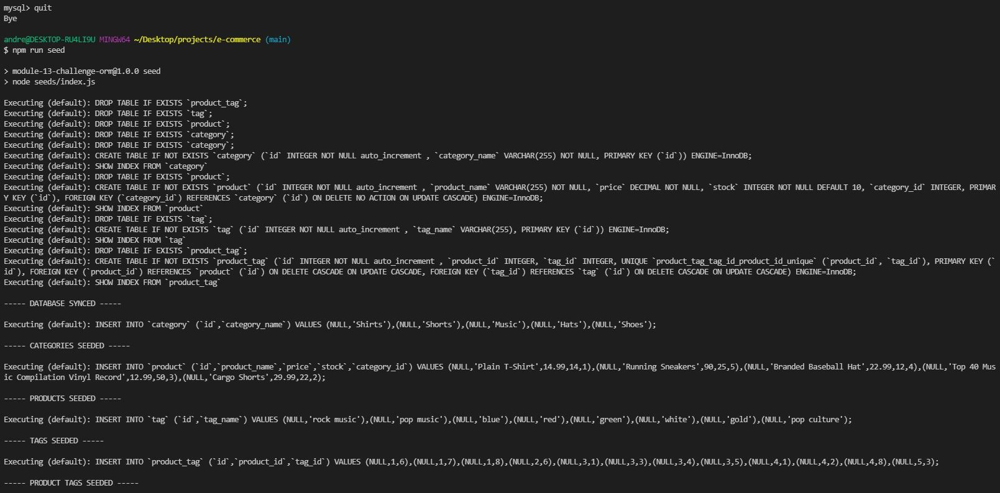
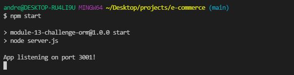
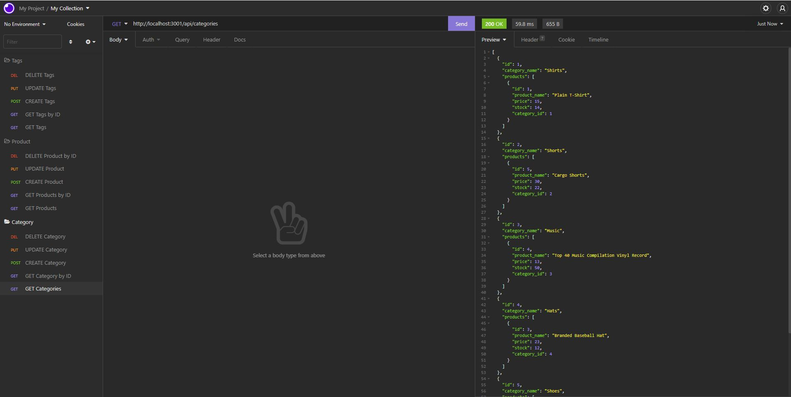
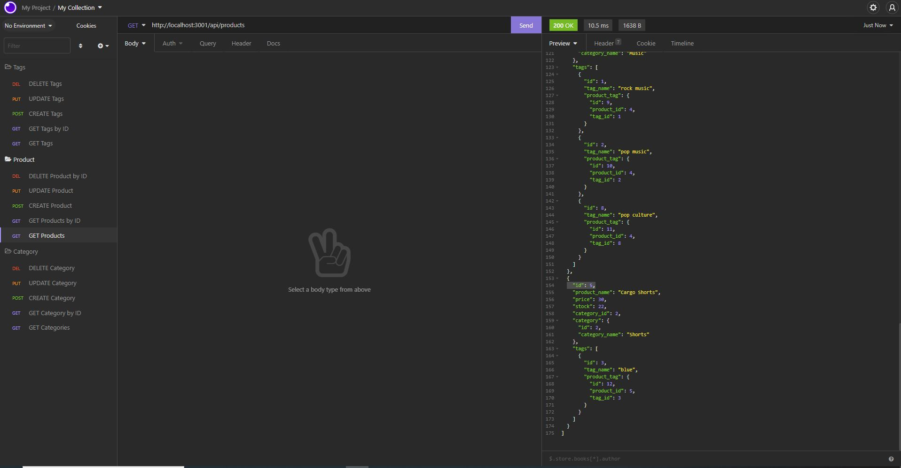
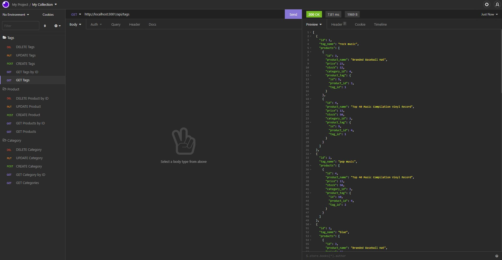

# E-Commerce Back-End 

## Description 

Create a Back-End API Routes to successfully connect to the Database to GET, CREATE, UPDATE & DELETE Data from the database using Sequelize

Repo: https://github.com/andrewyu22/e-commerce

Link: No link available for this project!

Video: https://watch.screencastify.com/v/WpuXcs07YmsxR1qaQ13u

---
## Table of Contents 

* [Installation](#installation)
* [Usage](#usage)
* [License](#license)
* [Contributing](#contributing)
* [Tests](#tests)
* [Questions](#questions)

---
## Installation

"npm install" to install all required dependency

---
## Usage 

To GET, CREATE, UPDATE & DELETE data to the database using API Routes.

1) Log in Mysql Terminal in the root folder of the project and type: "source db/schema.sql" 

2) Quit out MySql Terminal. In the bash terminal type in: "npm run seed"

3) In the bash terminal type in: "npm start" to start the server

4) Go to Insomnia to test out the routes: 

---
## License

No Licenses for this project!

---
## Contributing

No contribution information for this project!

---
## Tests

No Test for this project!

---
## Questions

Link to Github: https://github.com/andrewyu22

If you have any further questions, please contact me at andrewyu2654@gmail.com
